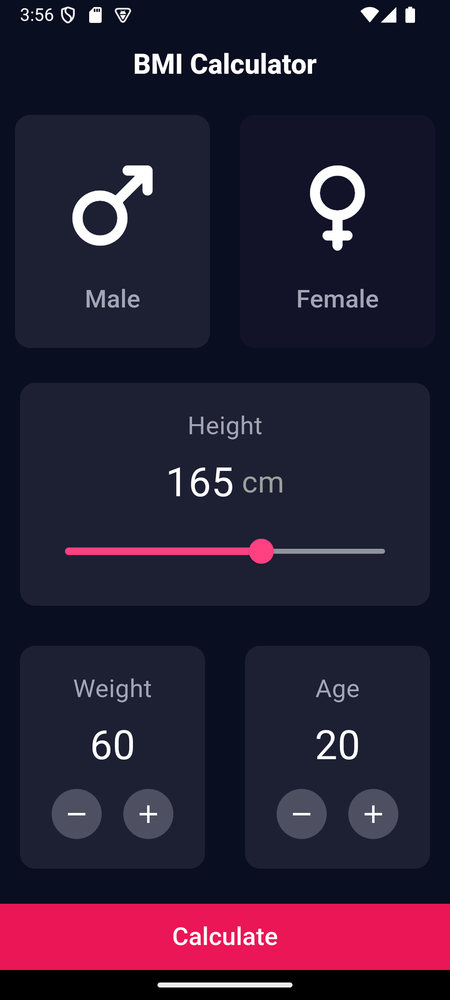
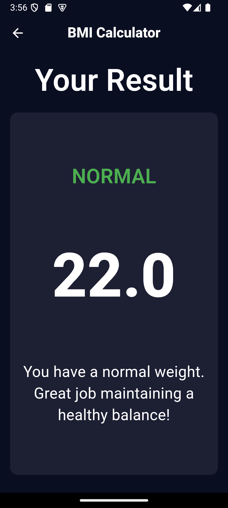

# bmi_calculator

Simple BMI calculator created by [the design](docs/design.webp)
found [on the Internet](https://reliasoftware.com/blog/flutter-project-ideas).

## Screenshots

## Development

### CLI

* `flutter analyze` - analyze the project's Dart code.
* `dart fix --apply` - apply automated fixes to Dart source code.
* `flutter test` - run Flutter unit tests.
* `flutter build apk --split-per-abi` - build an APK.
